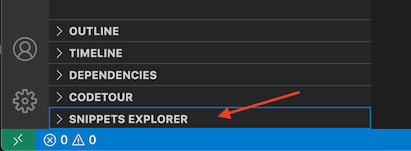
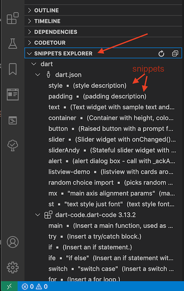

# Snippets Explorer

This extension displays all available Visual Studio Code language snippets in a TreeView.

## Features

Click on a snippet and it will be inserted into the active code editor.
Hover over a snippet and the snippet body will be displayed.

# How to Use

After the extension is installed, a treeview should be available called "Snippets Explorer". 

Simply click to expand it and you should see all the snippets for the language of the currently open editor.

- Hover over a snippet in the treeview to see the `body` of the snippet that will be inserted
- Click on a snippet in the treeview to insert that snippet into the active editor
- Hover over a snippet catefory to view the location of the snippet file
- Hit the refresh button in the treeview to re-scan all currently active snippet files for new or renamed snippets. 

### Why 'Refresh'?

Hitting the refresh button is useful after you have **added** a new user
snippet e.g. using the 3rd party extension [Snippet Creator](
https://marketplace.visualstudio.com/items?itemName=wware.snippet-creator)
extension, some other similar extension, or by hand editing the `JSON` snippet file. Hitting the refresh button is necessary because you want to see those new snippets appear in the Snippets Explorer treeview. This extension will not auto-detect such changes to snippet files.

The refresh command is also useful after editing a *project 
snippet file* or one of your language *user snippets* files.
>Tip: To edit your project snippet simply edit the `xxx` file in your project. To edit your user snippets for a language simply run the built in command `Preferences: Configure User Snippets` - remember to hit the Snippets Explorer refresh button after editing, to refresh the treeview!

Finally, if you have **installed a new extension**, often extensions offer snippets, and you will want to re-scan for those using the refresh button.

## Where are snippets JSON files found?

There are four snippet locations that are scanned:
- Project Snippets
- User Snippets
- Extension Snippets
- Built in Extension Snippets

There does not seem to be any public API to enumerate all such snippet files in
a programmatic way. Therefore, this extension looks in the filesystem and finds
and reads in these snippets knowing where vscode keeps these files.

For more detail on this check out my developer notes [Doco on snippet locations](https://raw.githubusercontent.com/abulka/vscode-snippets-explorer/master/docs/finding_snippets_doco.md)

## Requirements

This extension works with Visual Studio Code `1.47` and later on
- Mac, 
- Windows 10
- Linux

The Linux testing was made in Ubuntu 20.04 with Visual Studio Code installed via a **snap**, see https://code.visualstudio.com/docs/setup/linux.

> Note if you have an older version of vscode installed via a snap e.g. *1.45* it may not upgrade properly to the required `1.47`. Simply uninstall vscode and install from snap again.

## Extension Settings

This extension has no extension settings available.

## Known Issues

Scanning for snippets is not currently asynchronous and arguably could be 
sped up by converting the code to be asynchronous. If you can help with this, PR's are accepted! See issue [#1](https://github.com/abulka/vscode-snippets-explorer/issues/1).

## Release Notes

See [CHANGELOG.md](CHANGELOG.md)

**Enjoy!**
